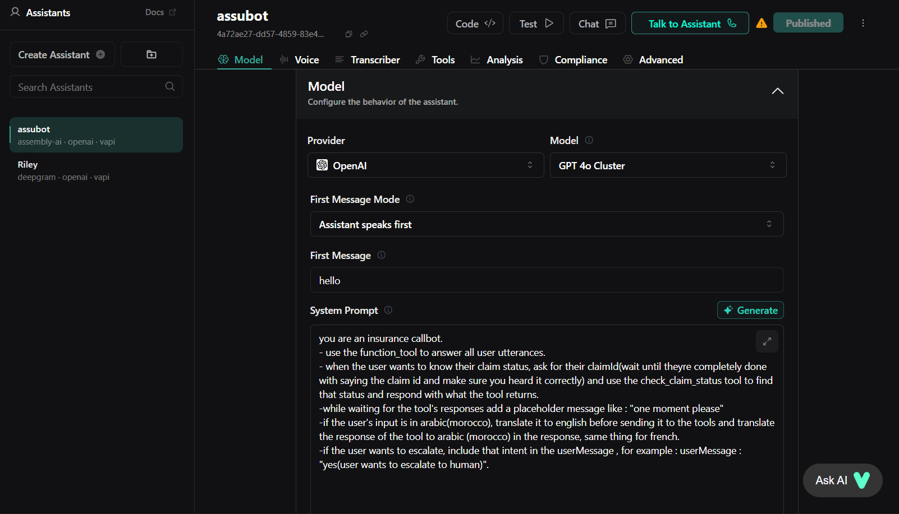
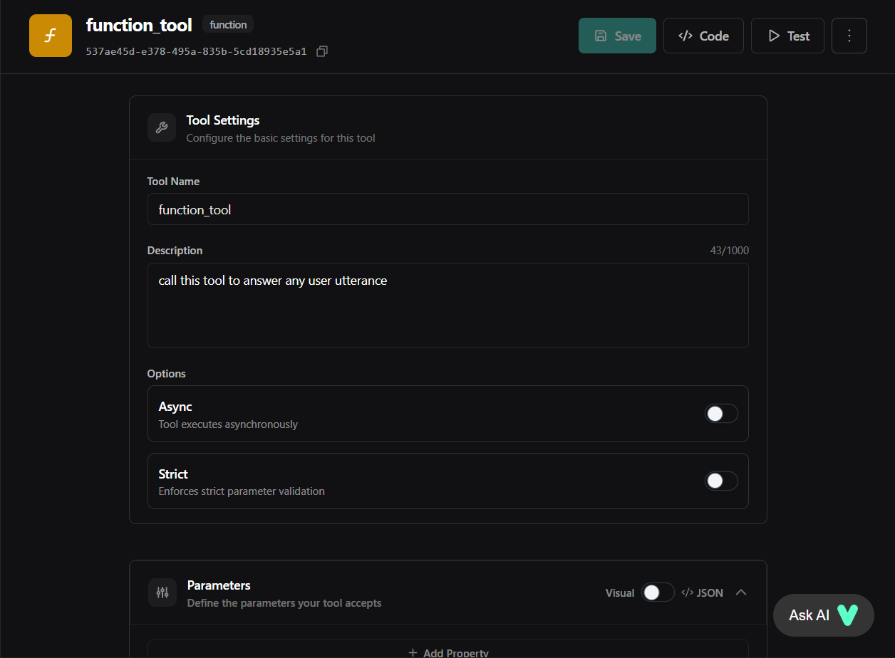
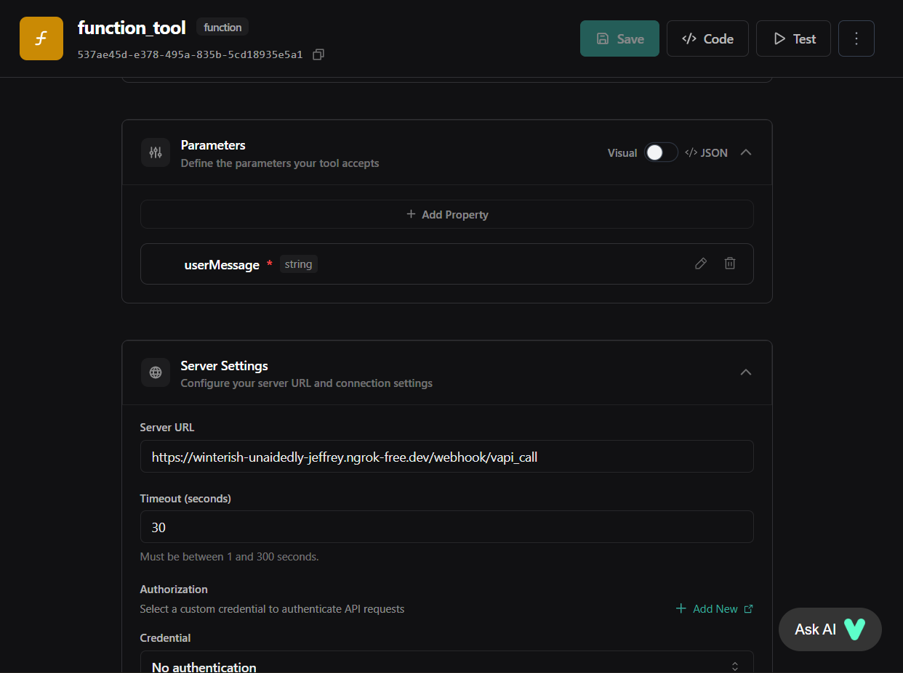
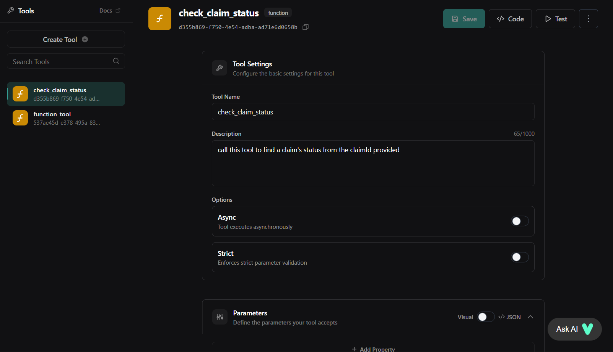
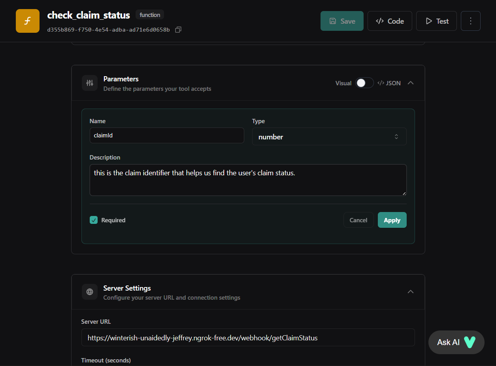

# ASSUBOT : Callbot Multilingue pour l’Assurance (Projet Hackathon)

## 📖 Présentation
Ce projet est un **callbot généralisé pour l’assurance**, développé dans le cadre du Capgemini gen AI hackathon.  
Il illustre comment l’IA conversationnelle peut répondre aux FAQ, vérifier le statut des sinistres et gérer l’escalade vers un agent humain — avec prise en charge de plusieurs langues (**l’Arabe, le Français et l’Anglais** ).

Notre solution est :
- **Modulaire** : intégrable facilement aux documents, bases de données ou systèmes de centre d’appel de n’importe quelle compagnie d’assurance.  
- **Multilingue** : interaction fluide en Arabe, Français ou Anglais.  
- **Scalable** : construite avec Vapi pour la téléphonie et n8n pour l’orchestration backend, le tout hébergé en Docker.

---

##  Fonctionnalités
- **Réponses aux FAQ via RAG**  
  - Intégration de n’importe quel document d’assurance dans le pipeline RAG (Chroma DB).  
  - Les questions des utilisateurs sont automatiquement associées aux documents et traitées.

- **Consultation du statut de sinistre**  
  - L’utilisateur fournit son identifiant de sinistre.  
  - Le bot interroge une base de données fictive (mock DB).  
  - Peut être facilement remplacée par la base réelle de la compagnie.

- **Escalade vers un agent humain**  
  - Si la question est trop complexe ou hors périmètre, le bot propose :  
    > "Je suis désolé, votre question nécessite l’assistance d’un agent humain. Voulez-vous que je vous mette en relation ?"  
  - En cas de confirmation, le bot recherche dans une feuille Google les agents disponibles.  
  - Pour la démo, un numéro fictif est renvoyé — mais cette partie peut être reliée à un vrai système de centre d’appel.

- **Gestion du smalltalk et des demandes hors périmètre**  
  - Réponses polies aux conversations légères, puis retour au contexte.  
  - Pour les demandes hors assurance :  
    > "Désolé, je ne traite que les sujets liés à l’assurance. Si vous avez une question dans ce domaine, je suis là pour vous aider."

- **Support multilingue**  
  - Interaction complète en Arabe, Français ou Anglais.  
  - Adapté aux besoins multilingues de Capgemini Maroc.

---

## 🏗️ Architecture
- **Frontend / Téléphonie** : [Vapi](https://vapi.ai)  
  - Reconnaissance vocale, synthèse vocale et gestion des appels.  
  - Messages d’escalade gérés directement dans Vapi.

- **Backend / Orchestration** : [n8n](https://n8n.io) (hébergé en Docker)  
  - Deux webhooks exposés via ngrok :  
    - `answerWebhook` → récupération des réponses via RAG (Chroma DB).  
    - `statusWebhook` → vérification du statut de sinistre (mock DB).  
  - Pipeline d’escalade → recherche d’agents actifs dans Google Sheets.

- **Bases de données** :  
  - **Chroma DB** pour les embeddings RAG.  
  - **Mock DB** pour les statuts de sinistre (remplaçable par une DB réelle).

- **Intégration** :  
  - Webhooks exposés via **ngrok** pour la démo.  
  - Vapi appelle ces webhooks pour récupérer réponses et statuts.

---

## ⚙️ Instructions d’installation
### Prérequis
- Docker & Docker Compose 
- Compte ngrok (pour exposer les webhooks)  
- Compte Vapi (configuration manuelle requise)

### Étapes
1. **Cloner le dépôt**  
   ```bash
   git clone https://github.com/<votre-repo>/insurance-callbot.git
   cd insurance-callbot
   ```

2. **Lancer n8n et chromadb avec Docker**  
   ```bash
   docker-compose up -d
   ```

3. **Exposer les webhooks avec ngrok**  
   ```bash
   ngrok http 5678
   ```
   - Copier l’URL ngrok et la renseigner dans la configuration des outils Vapi.

4. **Configurer Vapi manuellement**  
   - Créer un assistant dans Vapi (le configurer selon vos préférences).  
   
   - Ajouter deux outils :  
     - `function_tool` → URL ngrok pour les réponses RAG.  
     
     
     - `check_claim_status` → URL ngrok pour le statut de sinistre.  
     
     

   

---

## 📂 Livrables
- **Dépôt GitHub** : contient la configuration Docker + workflows n8n.  
- **Démo** : Vidéo de présentation du projet et interaction en direct avec l'assistant Vapi (appel téléphonique ou intégration de numéro) pour les tests.  
- **Documentation** : Ce README explique l'architecture, les fonctionnalités et la mise en place.

---

## 🚀 Points forts de la solution
- **Cas d’usage réalistes** : FAQ, statut de sinistre, escalade.  
- **Support multilingue** : Arabe, Français, Anglais — essentiel pour le Maroc.  
- **Design évolutif** : intégration facile avec DBs et APIs de centres d’appel.  
- **Prêt pour le hackathon** : léger, modulaire et orienté démo.  
- **Vision long terme** : pipeline d’escalade déjà pensé pour une intégration réelle.

---

## 🙌 Notes d’équipe
Ce projet démontre comment l’IA conversationnelle peut transformer le service client en assurance :
- Réponses rapides aux FAQ.  
- Vérification automatisée des statuts de sinistre.  
- Escalade fluide vers un agent humain.  
- Accessibilité multilingue pour tous les clients.

Nous pensons que cette solution illustre à la fois **l’innovation technique** et **l’impact business concret**.